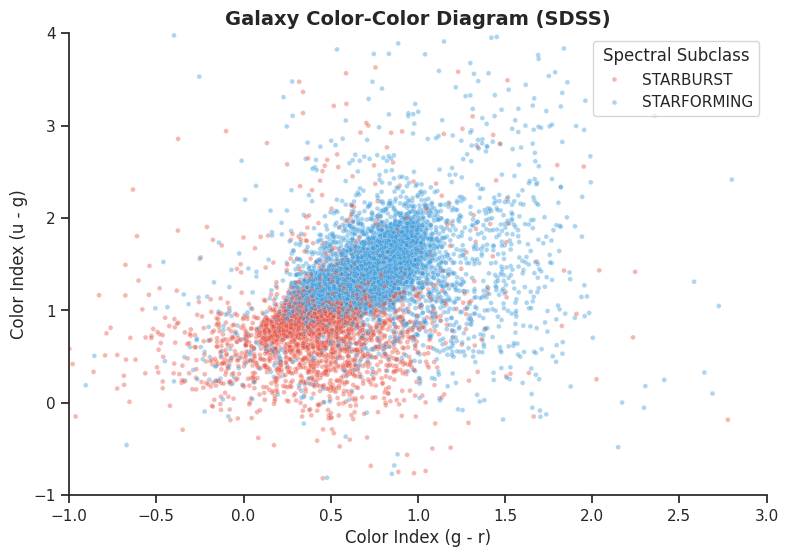
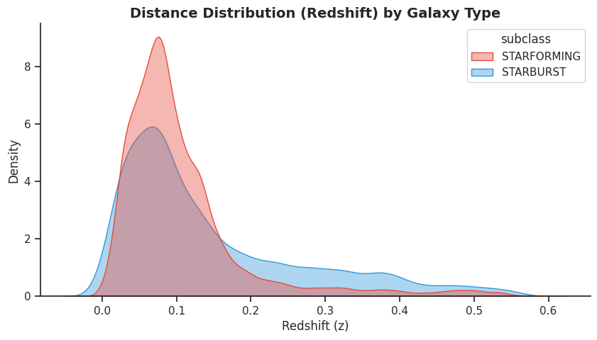
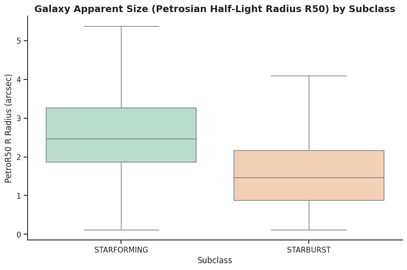

# Galaxy Classification with SDSS Data

## Overview

This project explores the physical differences between STARFORMING and STARBURST galaxies using data from the Sloan Digital Sky Survey (SDSS). The goal is to identify which observable properties best distinguish these two populations and to investigate whether their distributions are consistent with current ideas of galaxy evolution.

The analysis was performed in Python using a sample of approximately 100,000 galaxies.

---

## Data

The dataset was obtained from the Sloan Digital Sky Survey (SDSS) and contains photometric and structural properties for a large sample of galaxies classified as either STARFORMING or STARBURST.

Some of the properties analyzed include:

* Redshift
* Petrosian radius (PetroR50)
* Concentration index
* Color indices (u-g and g-r)

---

## Tools and Libraries

The analysis was carried out using:

* Python
* NumPy
* Pandas
* Matplotlib
* Seaborn

---

## Main Results

The analysis reveals several systematic differences between STARFORMING and STARBURST galaxies:

* STARBURST galaxies tend to exhibit bluer colors, indicating younger stellar populations and enhanced recent star formation activity.
* Structural properties suggest that STARBURST systems are generally more compact.
* The redshift distributions show observational biases that are consistent with selection effects such as the Malmquist bias.
* Color-color diagrams provide a clear separation between the two populations.

These results are consistent with the interpretation that STARBURST galaxies represent phases of intense and relatively recent star formation.

---

## Figures

### Color-Color Diagram

This diagram shows the distribution of STARFORMING and STARBURST galaxies in color space.



### Redshift Distribution

Comparison of the redshift distributions for both galaxy populations.



### Petrosian Radius

Distribution of the half-light radius (PetroR50) for STARFORMING and STARBURST galaxies.



---

## Repository Structure

```text
Galaxy_classification/
│
├── figures/
│   ├── boxplot.png
│   ├── color-color-diagram.png
│   └── distance-distr.png
│
├── SDSS_Galaxy_Population_Analysis.ipynb
├── README.md
└── sdss_100k_galaxy_form_burst.csv
```

---

## Future Work

Possible extensions of this project include:

* Applying machine learning classification techniques.
* Incorporating spectroscopic properties.
* Performing dimensionality reduction analyses.
* Comparing results with other galaxy samples and surveys.

---

## Author

Ignacio Peña

Bachelor's student in Astronomy
Universidad Andrés Bello
